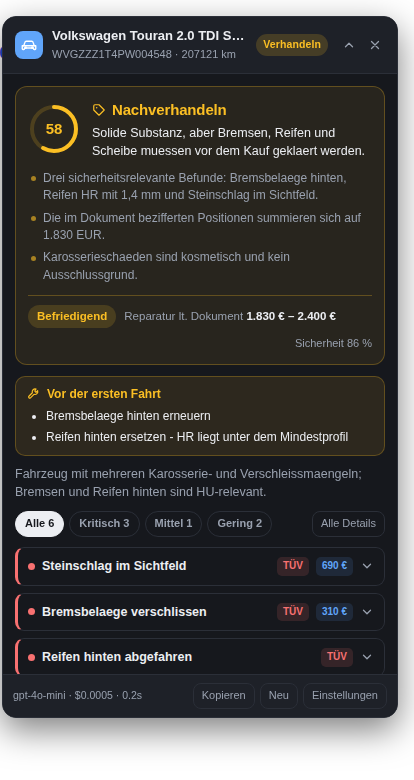

# Fahrzeug-Mängel-Scanner

Chrome-Extension, die auf Fahrzeugseiten automatisch **Fahrzeug PDF** und **Zustandsbericht**
findet, die PDFs herunterlädt, **vollständig** ausliest und per KI (OpenRouter) alle Mängel
samt **Kaufempfehlung** in einem kleinen Fenster oben rechts anzeigt.

<p>
</p>

## Was die Extension macht

1. **Erkennen** – findet auf jeder Seite Links wie „Fahrzeug PDF", „Zustandsbericht",
   „Appraisal", „Gutachten", „Prüfbericht" oder beliebige `.pdf`-Links und liest nebenbei
   FIN, Kilometerstand, Erstzulassung und Preis aus der Seite.
   Ein Panel erscheint nur, wenn die Seite wirklich nach einem Fahrzeug aussieht – kein
   Aufpoppen auf Blogs oder Preislisten.
2. **Laden** – holt die PDFs zuerst im Seitenkontext (nutzt also die bestehende Anmeldung
   beim Händler-/Auktionsportal) und fällt bei CORS-Blockaden auf den Hintergrunddienst zurück.
3. **Lesen** – extrahiert den Text lokal mit **pdf.js**, spaltenerhaltend, damit Tabellen aus
   Zustandsberichten erhalten bleiben. Siehe [Vollständigkeit](#vollständigkeit).
4. **Analysieren** – OpenRouter mit **Structured Output** (JSON-Schema), `temperature: 0`.
   Das Modell darf nichts erfinden und muss zu jedem Mangel ein wörtliches Zitat als Beleg liefern.
5. **Anzeigen** – Panel oben rechts: Kaufempfehlung, Zustands-Score, Mängel nach Schwere
   sortiert und filterbar, TÜV-Relevanz, Kosten laut Dokument, Reifenprofil, Verhandlungshebel,
   Seitenzahl und Beleg-Zitat pro Mangel. Verschiebbar, ein-/ausklappbar, hell und dunkel.

## Kaufempfehlung

Über der Mängelliste steht das Urteil – auch im eingeklappten Panel im Kopf sichtbar:

| Urteil | Bedeutung |
| --- | --- |
| **Kaufen** | keine relevanten Befunde |
| **Kaufen mit Vorbehalt** | kleinere, kalkulierbare Mängel |
| **Nachverhandeln** | deutliche Mängel, der Preis muss runter |
| **Finger weg** | schwere, teure oder sicherheitskritische Befunde |
| **Unklar** | die Datenlage im Dokument reicht für ein Urteil nicht aus |

Dazu gibt es:

- **Zustands-Score 0–100** als animierter Ring, allein aus dem Dokument abgeleitet
- **Begründungen**, jede auf einen konkreten Befund gestützt
- **Ausschlusskriterien** (roter Block) – z. B. Rost an tragenden Teilen, Motorschaden
- **Vor der ersten Fahrt** (gelber Block) – was verkehrssicherheitsrelevant ist
- **Verhandlungshebel** mit Beträgen, teuerster zuerst
- **Reparaturbudget** als Summe bzw. Spanne der im Dokument bezifferten Positionen
- **Preis-Einordnung**, sofern auf der Seite ein Preis steht (wird automatisch mitgelesen)

Das Urteil bewertet ausschließlich den **dokumentierten** Zustand. Es ersetzt keine
Besichtigung und keine Probefahrt.

## Vollständigkeit

Der Anspruch ist, dass wirklich das ganze Dokument ankommt – nicht die ersten Seiten:

- **Alle Seiten** werden ausgelesen, es gibt kein Seitenlimit.
- **Zu lange Dokumente** werden nicht gekürzt, sondern an Seitengrenzen in Teile zerlegt,
  jeder Teil vollständig ausgewertet und die Ergebnisse anschließend zu einem Gesamturteil
  zusammengeführt (inklusive Dubletten-Bereinigung). Ein 30-seitiger Prüfbericht landet so
  komplett bei der KI, nur eben in mehreren Aufrufen.
- **Seiten ohne Textebene** (Schadensskizzen, eingescannte Anhänge) werden erkannt und
  gezielt als Bild mitgeschickt, während der Rest weiter als Text läuft („Text + Bild").
- **Reine Scans** werden vollständig als Bilder ausgewertet.
- Unten im Panel steht, worauf die Auswertung beruht: *„30 von 30 Seiten gelesen · in 3 Teilen
  ausgewertet"*. Was nicht gelesen werden konnte, wird dort ausgewiesen statt verschwiegen.

## Installation

1. Repository herunterladen oder klonen.
2. In Chrome `chrome://extensions` öffnen, **Entwicklermodus** einschalten.
3. **Entpackte Erweiterung laden** → den Ordner `extension/` auswählen.
4. Die Optionsseite öffnet sich automatisch. Dort den OpenRouter-API-Key eintragen
   (erstellen auf [openrouter.ai/keys](https://openrouter.ai/keys)) und auf **Speichern** klicken.
   Mit **Testen** lässt sich die Verbindung sofort prüfen.

Der Key wird ausschließlich lokal in `chrome.storage.local` gespeichert und nur an OpenRouter
gesendet. Fahrzeugseiten und PDFs gehen an keinen anderen Server.

Danach passiert alles von selbst: Fahrzeugseite öffnen → Panel erscheint → Urteil steht da.

## Kosten und Modellwahl

**Ja, GPT-4o mini reicht für Text-PDFs.** Zustandsberichte sind Fließtext und Tabellen; die
Arbeit macht ohnehin pdf.js, das Modell muss nur strukturieren und bewerten. Mit
`temperature: 0` und JSON-Schema ist die Ausgabe stabil.

| Fall | Modell | Kosten pro Fahrzeug |
| --- | --- | --- |
| PDF mit Textlayer (Normalfall) | `openai/gpt-4o-mini` | rund **0,1 Cent** |
| Langer Bericht in mehreren Teilen | `openai/gpt-4o-mini` | pro Teil noch einmal so viel |
| Gescanntes PDF (Bilderkennung) | `openai/gpt-4o-mini` | ca. 2–4 Cent (Bilder kosten viele Tokens) |
| Gescanntes PDF, günstiger + besseres OCR | `google/gemini-2.0-flash-001` | Bruchteil davon |

Empfehlung: Textmodell auf GPT-4o mini lassen, für gescannte PDFs in den Optionen
Gemini 2.0 Flash als Scan-Modell wählen.

Zusätzlich spart die Extension automatisch:

- **Cache** – jedes PDF wird über seinen Hash erkannt; dasselbe Dokument wird nie zweimal
  bezahlt (Footer zeigt dann „Cache").
- **Ein Aufruf statt mehrerer** – Fahrzeug-PDF und Zustandsbericht gehen gemeinsam in eine
  Anfrage; erst wenn der Text nicht in einen Aufruf passt, wird geteilt.
- **Bilder nur, wo nötig** – die teure Bilderkennung greift für reine Scans und für einzelne
  Seiten ohne Textebene, nicht für das ganze Dokument. Die Seitenzahl ist gedeckelt.

## Einstellungen

| Einstellung | Bedeutung |
| --- | --- |
| API-Key / API-Endpunkt | OpenRouter-Zugang; Endpunkt nur ändern, wenn ein eigener Proxy genutzt wird |
| Modell / Scan-Modell | getrennte Modelle für Text-PDFs und gescannte PDFs |
| Automatisch starten | Analyse startet ohne Klick, sobald eine Fahrzeugseite erkannt wird |
| Bilderkennung + max. Seiten | Bildauswertung für Scans und textlose Seiten, mit Kostendeckel |
| Zeichen pro KI-Aufruf | ab wann ein Dokument in Teilen ausgewertet wird (Standard 120.000) |
| Sprache der Ausgabe | Deutsch oder Englisch |
| Modus / Domains | überall, nur auf bestimmten Domains oder überall außer bestimmten Domains |
| Zusätzliche Stichwörter | für ungewöhnlich benannte Links |
| Cache | Größe ansehen und leeren |

Über das Symbol in der Toolbar lässt sich eine Seite auch manuell prüfen.
„Kopieren" legt den kompletten Bericht inklusive Empfehlung, Verhandlungshebeln und
Beleg-Zitaten als Text in die Zwischenablage.

## Aufbau

```
extension/
  manifest.json            Manifest V3
  src/
    background.js          Service Worker: Ablauf, Chunk-Läufe, Zusammenführung, Cache
    content/content.js     Erkennung, PDF-Download im Seitenkontext, Panel (Shadow DOM)
    content/panel.css      Panel-Design, hell/dunkel, Animationen
    offscreen/             pdf.js-Textextraktion + Seitenrendering (SW hat kein DOM)
    options/, popup/       Einstellungen und Toolbar-Popup
    lib/config.js          Defaults, Modelle, Preise
    lib/prompt.js          Prompts, JSON-Schemata, verlustfreies Chunking
    lib/openrouter.js      API-Client mit Retry, Timeout, Kostenermittlung
    lib/cache.js           Text- und Ergebnis-Cache (LRU)
  vendor/pdfjs/            pdf.js 3.11.174 (Apache-2.0), lokal eingebunden
test/
  e2e.mjs                  End-to-End-Test mit echtem Chromium
  make-fixtures.py         erzeugt die Test-PDFs neu
  fixtures/                Testseiten, Test-PDFs, Mock-Antwort
```

## Tests

```bash
npm install -D playwright        # Chromium wird benötigt
node test/e2e.mjs
```

Der Test startet einen lokalen Fixture-Server und einen OpenRouter-Mock, lädt die Extension
ungepackt in Chromium und prüft 58 Punkte, unter anderem:

- Erkennung von Fahrzeugseiten und Fehlalarm-Freiheit auf Blog/Preisliste
- PDF-Download und Textextraktion inklusive erhaltener Tabellenspalten
- Prompt-Inhalt, Structured Output, `temperature: 0`
- Kaufempfehlung: Urteil, Score-Ring, Ausschlusskriterien, sortierte Verhandlungshebel
- **Vollständigkeit**: bei einem 30-seitigen Bericht muss jede einzelne Seite (per Marker
  nachgewiesen) in den Chunk-Prompts ankommen
- Hybrid-Modus: Text und die eine textlose Seite als Bild im selben Aufruf
- Cache-Treffer ohne zweiten API-Aufruf, auch für Scan- und Hybrid-Dokumente
- Aufklapp-Animation, Filter, Einklappen, Optionsseite, reduzierte Bewegung, keine SW-Fehler

Ist Chromium an einem anderen Ort installiert: `CHROME_PATH=/pfad/zu/chrome node test/e2e.mjs`.
Mit `MOCK_DELAY_MS=2000` lässt sich der Ladezustand in Ruhe betrachten.

## Grenzen

- PDFs, die sich nur über ein Formular (POST) oder reines JavaScript herunterladen lassen,
  kann die Extension nicht abrufen; sie meldet das im Panel.
- Passwortgeschützte PDFs werden nicht geöffnet.
- Die Auswertung ist so gut wie das Dokument: Was nicht im Zustandsbericht steht, taucht auch
  nicht im Panel auf, und die Kaufempfehlung kann nur bewerten, was dokumentiert ist. Deshalb
  steht bei jedem Mangel das Zitat aus dem PDF darunter und unten, auf wie vielen Seiten die
  Einschätzung beruht.
