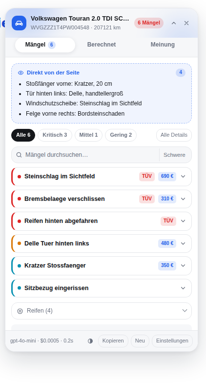
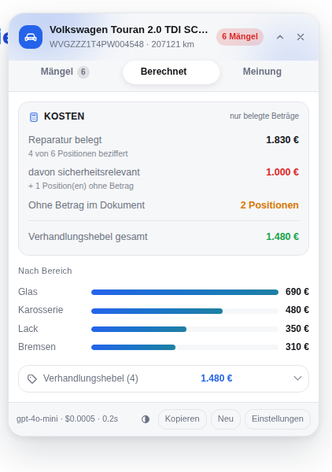
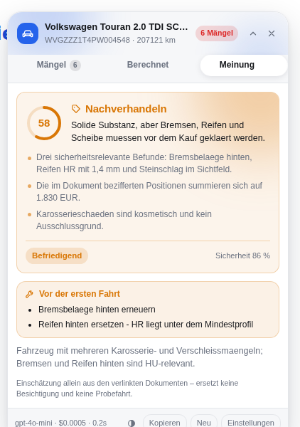
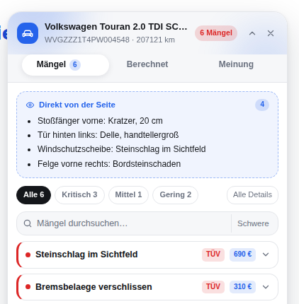
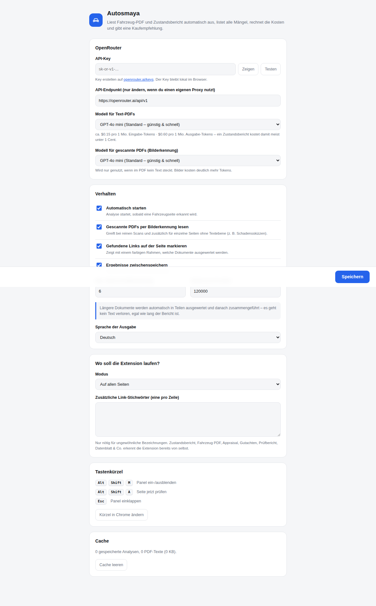

# Autosmaya

Chrome-Extension für **BCA Europe**: findet auf der Fahrzeugseite automatisch
**Fahrzeug PDF**, **Appraisal** und **Zustandsbericht**, lädt die PDFs, liest sie
**vollständig** aus und zeigt die Mängel in einem Panel oben rechts – ohne dass man
suchen muss.

Autosmaya wird ausschließlich auf `https://de.bca-europe.com/lot?id…` aktiv. Auf jeder
anderen Adresse liest sie die Seite nicht und lädt kein PDF – siehe [Zugriff](#zugriff).

Das Panel hat drei Tabs. **Was aufpoppt, sind die Mängel** – nüchtern und ohne Bewertung.
Die Rechnung und die Einschätzung liegen jeweils einen Klick daneben.

<p>

</p>

| Tab | Inhalt |
| --- | --- |
| **Mängel** (Start) | Schäden von der Seite, dann die Liste aus dem PDF – Schwere, TÜV-Relevanz, Kosten, Beleg-Zitat. Keine Meinung. |
| **Berechnet** | Kostenrechnung aus belegten Beträgen; nennt das Dokument keine, tritt der gezählte Befund an ihre Stelle. Dazu Bereichsverteilung und Verhandlungshebel |
| **Meinung** | Kaufempfehlung mit Zustands-Score, Begründungen, Ausschlusskriterien – und bei „Unklar“ die fehlenden Angaben |

Unter den Tabs sitzt der **Chat**: Fragen zum Dokument, beantwortet ausschließlich aus dem
bereits gelesenen PDF.

Auch der Kopf des Panels und das Toolbar-Symbol bleiben sachlich: dort steht die Zahl der
Mängel, nicht das Urteil.

## Was die Extension macht

0. **Sofort sichtbar** – zeigt Schäden, die BCA bereits auf der Seite listet, direkt im Panel
   an („Direkt von der Seite"), noch bevor das PDF ausgewertet ist – die Einträge unter *Schäden*.
1. **Erkennen** – findet auf der Losseite Links wie „Fahrzeug PDF", „Appraisal",
   „Zustandsbericht", „Gutachten", „Prüfbericht" oder beliebige `.pdf`-Links und liest nebenbei
   FIN, Kilometerstand, Erstzulassung und Preis aus der Seite.
   Ohne gefundenes Dokument erscheint kein Panel.
2. **Laden** – holt Dokumente vom selben Ursprung wie die Fahrzeugseite direkt im
   Seitenkontext; alles andere lädt der Hintergrunddienst, der als First-Party-Anfrage
   läuft und die bestehende Anmeldung beim Händler-/Auktionsportal mitschickt.
   Antwortet das Portal mit einer Warteseite („Ihre PDF ist in Vorbereitung"), schickt
   die Extension deren Formular genauso ab wie die Seite es selbst täte – bei BCA ist
   dieser POST der einzige Weg zum PDF.
3. **Lesen** – extrahiert den Text lokal mit **pdf.js**, spaltenerhaltend, damit Tabellen aus
   Zustandsberichten erhalten bleiben. Siehe [Vollständigkeit](#vollständigkeit).
4. **Analysieren** – OpenRouter (Standard `amazon/nova-2-lite-v1`) mit **Structured Output**
   (JSON-Schema), `temperature: 0`.
   Das Modell darf nichts erfinden und muss zu jedem Mangel ein wörtliches Zitat als Beleg liefern.
5. **Anzeigen** – Panel oben rechts: Kaufempfehlung, Zustands-Score, Kostenrechnung, Mängel
   nach Schwere sortiert und filterbar, TÜV-Relevanz, Reifenprofil, Verhandlungshebel,
   Seitenzahl und Beleg-Zitat pro Mangel.

## Chat zum Dokument

Unter dem Panel sitzt eine Eingabe: **Zum Dokument fragen**. Die Antwort kommt
ausschließlich aus dem PDF, das die Extension ohnehin schon gelesen hat – kein Weltwissen,
keine Schätzung. Steht die Antwort nicht im Dokument, sagt der Chat genau das.

Was pro Frage an die KI geht, ist bewusst gedeckelt:

| Teil | Warum |
| --- | --- |
| Dokumenttext (einmal, gekürzt auf `maxChars`) | die eigentliche Quelle; kommt aus dem Cache, das PDF wird nicht erneut gelesen |
| Angaben von der Fahrzeugseite | FIN, Kilometer, Preis – damit Rückfragen dazu funktionieren |
| die letzten **3** Frage/Antwort-Paare | Nachfragen wie „und was kostet das?" funktionieren, ohne dass der Verlauf unbegrenzt mitwächst |

Ältere Runden fallen heraus. Der Tokenverbrauch pro Frage bleibt damit vorhersehbar,
statt mit jeder Frage weiterzuwachsen.

Während die Antwort entsteht, laufen drei Punkte im Verlauf – sonst steht nach dem Absenden
nichts da und es sieht aus, als sei die Frage verloren gegangen.

## Wenn die Auswertung leer bleibt

Ein Zustandsbericht in einem einzigen Aufruf mit vollem JSON-Schema auszuwerten ist für
kleinere Modelle die schwerere Aufgabe als eine freie Frage im Chat. Beobachtet: die Analyse
meldete „Keine Mängel dokumentiert“, während dieselbe Datei im Chat mehrere Vorschäden
und wertmindernde Faktoren hergab.

Dagegen stehen drei Dinge:

1. Der Prompt benennt die Abschnitte, in denen Zustandsberichte ihre Befunde führen –
   *Vorschäden*, *wertmindernde Faktoren*, *Gebrauchsspuren*, fällige HU, und jede Zeile mit
   einer Maßnahme wie „instandsetzen“ oder „erneuern“. Ohne diese Liste ordnet ein Modell
   Tabellenzeilen gern der Ausstattung zu.
2. Bleibt die Liste trotzdem leer, obwohl der Dokumenttext mindestens drei verschiedene
   Befundwörter enthält, wertet die Extension **ein zweites Mal in kleineren Teilen** aus.
   Das kostet einen zusätzlichen Aufruf, aber nur in genau diesem Fall.
3. Bleibt es auch danach leer, zeigt das Panel **kein** beruhigendes „keine Mängel“, sondern
   benennt den Widerspruch und bietet eine neue Auswertung an. Ein falsches Entwarnen ist
   beim Auktionskauf der teuerste Fehler.

## Kaufempfehlung

Bewusst **nicht** auf dem Startbildschirm, sondern im Tab **Meinung** – wer nur die Schäden
sehen will, bekommt keine Bewertung aufgedrängt:

| Urteil | Bedeutung |
| --- | --- |
| **Kaufen** | keine relevanten Befunde |
| **Kaufen mit Vorbehalt** | kleinere, kalkulierbare Mängel |
| **Nachverhandeln** | deutliche Mängel, der Preis muss runter |
| **Finger weg** | schwere, teure oder sicherheitskritische Befunde |
| **Unklar** | die Datenlage im Dokument reicht für ein Urteil nicht aus |

Dazu gibt es:

- **Zustands-Score 0–100** als animierter Ring, allein aus dem Dokument abgeleitet. Bei
  **Unklar** bleibt der Ring leer: eine 0 hieße „Totalschaden“, gemeint ist aber „keine Angabe“
- **Begründungen**, jede auf einen konkreten Befund gestützt
- **Ausschlusskriterien** (roter Block) – z. B. Rost an tragenden Teilen, Motorschaden
- **Vor der ersten Fahrt** (gelber Block) – was verkehrssicherheitsrelevant ist
- **Verhandlungshebel** mit Beträgen, teuerster zuerst
- **Reparaturbudget** als Summe bzw. Spanne der im Dokument bezifferten Positionen
- **Preis-Einordnung**, sofern auf der Seite ein Preis steht (wird automatisch mitgelesen)
- **Warum unklar** – welche Angaben im Dokument fehlen, damit ein Urteil möglich wäre

Das Urteil bewertet ausschließlich den **dokumentierten** Zustand. Es ersetzt keine
Besichtigung und keine Probefahrt – das steht auch im Tab selbst.

## Zugriff

Autosmaya ist bewusst eng eingezäunt. Zwei Schranken, die zweite kann die erste nicht öffnen:

1. **Im Manifest** stehen als einzige Berechtigungen `https://de.bca-europe.com/*`,
   `https://*.bca-europe.com/*` (für PDFs auf Nachbar-Hosts) und `https://openrouter.ai/*`.
   Chrome injiziert das Content-Script nirgendwo sonst – auch nicht auf anderen BCA-Domains.
2. **In den Einstellungen** steht die Adressliste, standardmäßig
   `https://de.bca-europe.com/lot?id`. Erst wenn die aktuelle Adresse dazu passt, wird die
   Seite überhaupt gelesen. Endet ein Eintrag auf `?name`, muss dieser Parameter vorhanden
   sein – die Reihenfolge der Parameter ist egal.

Damit passiert auf `de.bca-europe.com/` (Startseite), `…/lot` ohne `id` oder `…/suche?id=1`
nichts: kein Auslesen, kein Download, kein Panel. Der Test prüft jeden dieser Fälle einzeln.

Die Berechtigungen der Extension sind entsprechend knapp: `storage`, `offscreen`,
`unlimitedStorage` – kein `tabs`, kein `activeTab`, kein `scripting`, kein `<all_urls>`.

### BCA-Besonderheiten

- Die BCA-Bezeichnungen **Appraisal**, **Fahrzeug PDF** und **Schadenaufstellung** zählen
  direkt als Zustandsbericht.
- Der Abschnitt **Schäden** der Seite wird ausgelesen und sofort angezeigt, inklusive
  Tabellen der Form „Bauteil / Beschreibung".
- Weitere Adressen lassen sich in den Einstellungen ergänzen, solange sie auf
  `de.bca-europe.com` liegen; für andere Hosts müsste zusätzlich das Manifest erweitert werden.

## Berechnet

Der Tab **Berechnet** rechnet zusammen, was das Dokument hergibt – ohne Schätzungen des
Modells. Jede Zeile ist auf belegte Beträge zurückführbar:

| Zeile | Woher |
| --- | --- |
| Reparatur belegt | Summe aller Mängel mit Betrag im Dokument, plus „4 von 6 Positionen beziffert" |
| Summe laut Dokument | falls das Dokument selbst eine Gesamtsumme nennt und sie abweicht |
| davon sicherheitsrelevant | nur die HU-/verkehrssicherheitsrelevanten Positionen |
| Ohne Betrag im Dokument | wie viele Mängel unbeziffert bleiben – der Rest ist offenes Risiko |
| Angebotspreis | wird von der Fahrzeugseite gelesen |
| **Effektivpreis** | Angebotspreis + belegte Reparatur – was das Auto real kostet |
| Verhandlungsziel | Angebotspreis − Summe der Verhandlungshebel |

Steht kein Preis auf der Seite, entfällt der untere Teil und es wird nur die Reparatursumme
ausgewiesen. Darunter zeigt ein Balkendiagramm, welcher Bereich (Glas, Karosserie, Lack …)
wie viel der belegten Kosten ausmacht.

## Oberfläche

Weiche Formen, ruhige Bewegung – nichts springt:

- **Morph beim Tab-Wechsel**: Der Körper des Panels fährt seine Höhe weich auf die neue Größe,
  der Inhalt blendet dabei leicht versetzt ein.
- **Tab-Blob**: Der Indikator gleitet unter den aktiven Tab und verformt sich dabei kurz
  organisch, statt hart zu springen.
- **Weiche Farbschleier** im Kopf und hinter dem Urteil, langsam driftend.
- **Kostenbalken** wachsen nacheinander aus dem Nullpunkt.
- Alles davon respektiert `prefers-reduced-motion`.

## Sichtbarkeit und Bedienung

- **Toolbar-Symbol** trägt den Befund: farbiges Abzeichen mit der Zahl der Mängel (rot, sobald
  kritische dabei sind), im Tooltip die Aufschlüsselung. Sichtbar ohne offenes Panel.
- **Markierte Links**: die erkannten Dokumente bekommen auf der Seite einen farbigen Rahmen
  (rot = Zustandsbericht, blau = sonstiges PDF). Abschaltbar.
- **Rückhol-Pille**: geschlossen verschwindet das Panel nicht, sondern schrumpft zu einer
  kleinen Pille mit der Mängelzahl.
- **Suche und Sortierung** in der Mängelliste (ab 5 Mängeln), sortierbar nach Schwere,
  Kosten oder Seite.
- **Sprung ins PDF**: Klick auf „Seite 17" öffnet das Dokument direkt auf dieser Seite.
- **Größe und Position** frei einstellbar und gespeichert; Darstellung automatisch, hell
  oder dunkel per Schalter in der Fußzeile.
- **Popup** zeigt Befund und Leseabdeckung des aktuellen Tabs.
- **Tastenkürzel**: `Alt+Shift+M` Panel ein-/ausblenden, `Alt+Shift+A` Seite jetzt prüfen,
  `Esc` einklappen. In Chrome frei änderbar.

## Vollständigkeit

Der Anspruch ist, dass wirklich das ganze Dokument ankommt – nicht die ersten Seiten:

- **Alle Seiten** werden ausgelesen, es gibt kein Seitenlimit.
- **Zu lange Dokumente** werden nicht gekürzt, sondern an Seitengrenzen in Teile zerlegt,
  jeder Teil vollständig ausgewertet und die Ergebnisse anschließend zu einem Gesamturteil
  zusammengeführt (inklusive Dubletten-Bereinigung). Ein 30-seitiger Prüfbericht landet so
  komplett bei der KI, nur eben in mehreren Aufrufen.
- **Seiten ohne Textebene** (Schadensskizzen, eingescannte Anhänge) werden erkannt und
  gezielt als Bild mitgeschickt, während der Rest weiter als Text läuft („Text + Bild").
- **Reine Scans** werden vollständig als Bilder ausgewertet.
- Unten im Panel steht, worauf die Auswertung beruht: *„30 von 30 Seiten gelesen · in 3 Teilen
  ausgewertet"*. Was nicht gelesen werden konnte, wird dort ausgewiesen statt verschwiegen.

## Installation

1. Repository herunterladen oder klonen.
2. In Chrome `chrome://extensions` öffnen, **Entwicklermodus** einschalten.
3. **Entpackte Erweiterung laden** → den Ordner `extension/` auswählen.
4. Die Optionsseite öffnet sich automatisch. Dort den OpenRouter-API-Key eintragen
   (erstellen auf [openrouter.ai/keys](https://openrouter.ai/keys)) und auf **Speichern** klicken.
   Mit **Testen** lässt sich Key und Modell-ID sofort prüfen.

Der Key gehört **nicht** ins Repository und steht in keiner Datei dieses Projekts – er wird
nur auf der Optionsseite eingegeben.

Der Key wird ausschließlich lokal in `chrome.storage.local` gespeichert und nur an OpenRouter
gesendet. Fahrzeugseiten und PDFs gehen an keinen anderen Server.

Danach passiert alles von selbst: Fahrzeugseite auf BCA öffnen → Panel erscheint →
die Mängel stehen da.

<p></p>

## Kosten und Modellwahl

Voreingestellt ist **`amazon/nova-2-lite-v1`** für Text-PDFs und für gescannte PDFs.

Das Modellfeld ist ein freies Textfeld mit Vorschlagsliste: Es lässt sich jede Modell-ID von
[openrouter.ai/models](https://openrouter.ai/models) eintragen, exakt in deren Schreibweise.
Passt die ID nicht, sagt das Panel das im Klartext („Modell nicht gefunden …"); mit **Testen**
auf der Optionsseite lässt sich das vorab prüfen.

Beherrscht ein Modell keine Structured Outputs, wiederholt Autosmaya die Anfrage automatisch
im JSON-Modus – die Auswertung läuft also auch dann.

Die Kosten meldet OpenRouter je Aufruf zurück; sie stehen unten im Panel. Für Modelle mit
hinterlegtem Preis (z. B. GPT-4o mini: rund **0,1 Cent** pro Fahrzeug) zeigt die Optionsseite
zusätzlich eine Vorabschätzung. Für gescannte PDFs ist `google/gemini-2.0-flash-001` eine
günstige Alternative mit starkem OCR.

Zusätzlich spart die Extension automatisch:

- **Cache** – jedes PDF wird über seinen Hash erkannt; dasselbe Dokument wird nie zweimal
  bezahlt (Footer zeigt dann „Cache").
- **Ein Aufruf statt mehrerer** – Fahrzeug-PDF und Zustandsbericht gehen gemeinsam in eine
  Anfrage; erst wenn der Text nicht in einen Aufruf passt, wird geteilt.
- **Bilder nur, wo nötig** – die teure Bilderkennung greift für reine Scans und für einzelne
  Seiten ohne Textebene, nicht für das ganze Dokument. Die Seitenzahl ist gedeckelt.

## Einstellungen

| Einstellung | Bedeutung |
| --- | --- |
| API-Key / API-Endpunkt | OpenRouter-Zugang; Endpunkt nur ändern, wenn ein eigener Proxy genutzt wird |
| Modell / Scan-Modell | frei eintragbare OpenRouter-Modell-IDs, getrennt für Text und Scans |
| Automatisch starten | Analyse startet ohne Klick, sobald eine Fahrzeugseite erkannt wird |
| Links markieren | farbiger Rahmen um die erkannten Dokument-Links auf der Seite |
| Bilderkennung + max. Seiten | Bildauswertung für Scans und textlose Seiten, mit Kostendeckel |
| Zeichen pro KI-Aufruf | ab wann ein Dokument in Teilen ausgewertet wird (Standard 120.000) |
| Sprache der Ausgabe | Deutsch oder Englisch |
| Erlaubte Adressen | auf welchen BCA-Adressen Autosmaya arbeiten darf |
| Zusätzliche Stichwörter | für ungewöhnlich benannte Links |
| Cache | Größe ansehen und leeren |

„Kopieren" legt den kompletten Bericht inklusive Empfehlung, Verhandlungshebeln und
Beleg-Zitaten als Text in die Zwischenablage.

<p></p>

## Aufbau

```
extension/
  manifest.json            Manifest V3
  src/
    background.js          Service Worker: Ablauf, Chunk-Läufe, Zusammenführung, Cache
    content/content.js     Portal-Profile (BCA), Erkennung, Seiten-Schäden, PDF-Download,
                           Panel mit Tabs (Shadow DOM)
    content/panel.css      Panel-Design, hell/dunkel, Morph-Animationen
    offscreen/             pdf.js-Textextraktion + Seitenrendering (SW hat kein DOM)
    options/, popup/       Einstellungen und Toolbar-Popup
    components/ui/         React-Komponenten (shadcn-Ablage)
      agent-dock.tsx       Chat-Leiste
    content/main.tsx       Einstiegspunkt: Panel-Rahmen + React
    content/panel.js       Rahmen: Kopf, Tab-Leiste, Fuß, Ziehen, Größe
    content/panel-body.tsx Inhalt des Panels (React)
    content/tabs/          Mängel, Berechnet, Meinung, Icons
    content/views/         Start, Laden, Fehler, Diagnose
    content/chat-dock.tsx  Chat zum Dokument
    content/bridge.ts      Brücke zwischen Panel und React
    styles/tailwind.css    Tailwind-Einstieg
    lib/result.ts          Typen des Analyseergebnisses
    lib/format.ts          Beträge, Kostenrechnung
    lib/utils.ts           cn() – shadcn-Konvention
    lib/config.js          Defaults, Modelle, Preise
    lib/prompt.js          Prompts, JSON-Schemata, verlustfreies Chunking
    lib/openrouter.js      API-Client mit Retry, Timeout, Kostenermittlung
    lib/cache.js           Text- und Ergebnis-Cache (LRU)
  vendor/pdfjs/            pdf.js 3.11.174 (Apache-2.0), lokal eingebunden
test/
  e2e.mjs                  End-to-End-Test mit echtem Chromium
  chat.mjs                 Chat: Kontext, Verlaufsdeckel, Schreibanzeige
  empty-recheck.mjs        Gegenprobe bei leerer Mängelliste
  dist-current.mjs         wacht darüber, dass dist/ zum Quellcode passt
  bca-viewpdf.mjs          Dokumentenabruf über zwei Origins (BCA-Topologie)
  tabs-sparse.mjs          Berechnet/Meinung bei dünner Datenlage
  make-fixtures.py         erzeugt die Test-PDFs neu
  fixtures/                Testseiten, Test-PDFs, Mock-Antwort
```

## Bauen und laden

Die Extension wird gebaut: React, TypeScript und Tailwind brauchen einen Build-Schritt.

In Chrome unter `chrome://extensions` → **Entwicklermodus** an → **Entpackte Erweiterung
laden** → den Ordner `extension/` wählen. Das funktioniert direkt nach dem Herunterladen,
auch ohne Node: `extension/dist/` ist eingecheckt.

Wer am Code arbeitet, braucht den Build:

```bash
npm install
npm run build      # schreibt extension/dist/
npm run dev        # dasselbe im Watch-Modus
```

**Nach jeder Änderung am Quellcode muss `extension/dist/` neu gebaut und mit eingecheckt
werden** – sonst lädt ein Download still den alten Stand. `test/dist-current.mjs` baut neu
und vergleicht; weicht etwas ab, schlägt der Test fehl und nennt die Datei.

Warum kein Dev-Server mit HMR: MV3 verbietet `unsafe-eval`, und genau das braucht Vites
HMR-Laufzeit. `npm run dev` baut deshalb bei jeder Änderung neu; in Chrome reicht dann ein
Klick auf **Neu laden** bei der Extension.

Die React-Komponenten liegen in `extension/src/components/ui/` – die shadcn-Ablage, auf die
der Alias `@/components/ui` zeigt (siehe `tsconfig.json` und `vite.config.ts`). Wer `shadcn`
per CLI nachrüsten will, findet den Pfad dort erwartungsgemäß vor; neue Komponenten kommen
in denselben Ordner, damit Alias und CLI zusammenpassen.

Die Aufteilung zwischen Panel und React: `content/panel.js` besitzt weiterhin den
Shadow-Root und den Rahmen – Kopf, Tab-Leiste, Fuß, Ziehen und Größe. React besitzt den
Inhalt (`.vms-body`) und den Chat darunter. Beide Knoten werden nach jedem Neuaufbau des
Rahmens wieder eingehängt, damit React seinen Zustand behält: Suchtext, aufgeklappte Karten
und Chatverlauf bleiben stehen. Zustand, der das Panel als Ganzes betrifft, fließt über
`content/bridge.ts` zu React; was nur die Tabs angeht (Filter, Suche, Sortierung), gehört
React allein.

Tailwind läuft mit abgeschaltetem Preflight: das Panel lebt in einem Shadow-DOM, in dem es
kein `html`/`body` gibt, auf das Preflight zielen könnte. Die Basiswerte setzt stattdessen
`.vms-app` in `extension/src/styles/tailwind.css`. Das kompilierte CSS wird als Text ins
Bundle gezogen (`?inline`) und in den Shadow-Root gehängt – von außen greift dort kein
Stylesheet.

Drei Stolpersteine, die dieser Aufbau mitbringt und die in den Dateien auch so kommentiert
sind:

- Die Basisregeln stehen in `@layer base`, also **vor** den Utilities. Am Dateiende würden
  sie diese überschreiben – Knöpfe blieben dann ohne Hintergrund.
- Sie stehen zusätzlich in `:where()`, damit `.vms-app button` (0,1,1) nicht schwerer wiegt
  als eine Utility wie `bg-panel-accent` (0,1,0).
- Ohne Preflight fehlt `border-style: solid`. Ohne das bleibt **jede** `border`-Utility
  wirkungslos, weil `border-style` von Haus aus `none` ist.

Die Farben kommen aus denselben Tokens, die `panel.css` auf `.vms-root` setzt (`--accent`,
`--text`, …). Sie sind in `tailwind.config.js` als Funktion hinterlegt, damit auch
`bg-panel-accent/12` funktioniert: bei einer nackten `var()`-Farbe kann Tailwind keinen
Alphakanal einrechnen und lässt den Modifier stillschweigend fallen. `color-mix` löst das.
Für Text auf Akzentflächen gibt es `--on-accent`; im dunklen Thema ist `--accent` ein helles
Blau, auf dem Weiß nur rund 2,3:1 Kontrast bringt.

## Tests

```bash
npm install
npm test        # baut die Extension und lässt alle vier Suiten laufen
```

Einzeln geht auch, nach einem `npm run build`:

```bash
node test/dist-current.mjs
node test/e2e.mjs
node test/bca-viewpdf.mjs
node test/tabs-sparse.mjs
node test/chat.mjs
node test/empty-recheck.mjs
```

Der Test startet einen lokalen Fixture-Server und einen OpenRouter-Mock, lädt die Extension
ungepackt in Chromium und prüft 95 Punkte, unter anderem:

- Erkennung von Fahrzeugseiten und Fehlalarm-Freiheit auf Blog/Preisliste
- PDF-Download und Textextraktion inklusive erhaltener Tabellenspalten
- Prompt-Inhalt, Structured Output, `temperature: 0`
- Kaufempfehlung: Urteil, Score-Ring, Ausschlusskriterien, sortierte Verhandlungshebel
- **Vollständigkeit**: bei einem 30-seitigen Bericht muss jede einzelne Seite (per Marker
  nachgewiesen) in den Chunk-Prompts ankommen
- Hybrid-Modus: Text und die eine textlose Seite als Bild im selben Aufruf
- Cache-Treffer ohne zweiten API-Aufruf, auch für Scan- und Hybrid-Dokumente
- **Berechnet**: belegte Summe, sicherheitsrelevanter Anteil, Effektivpreis und
  Verhandlungsziel gegen erwartete Beträge geprüft
- **Zugriff**: Der Test leitet `de.bca-europe.com` per HTTPS auf den Fixture-Server um und
  prüft einzeln, dass auf Startseite, `/lot` ohne `id`, `/suche?id=1` und einer fremden Domain
  weder Panel noch Zugriff entsteht – und dass die Parameterreihenfolge egal ist
- **BCA**: „Appraisal" als Zustandsbericht und die sofort angezeigten Schäden von der Seite
- Tabs: Start auf „Mängel", keine Bewertung dort, Morph der Höhe, wandernder Tab-Blob
- Suche, Sortierung nach Kosten, Seitensprung, Theme-Schalter, Link-Markierung,
  Toolbar-Abzeichen, Rückhol-Pille, Esc-Kürzel, Popup-Zustand
- Aufklapp-Animation, Filter, Einklappen, Optionsseite, reduzierte Bewegung, keine SW-Fehler

`test/bca-viewpdf.mjs` bildet zusätzlich die echte BCA-Topologie nach: Fahrzeugseite und
Dokument liegen auf **verschiedenen Origins**, das Dokument ist nur mit Session-Cookie
abrufbar und entsteht in einem der beiden Fälle erst, wenn das JavaScript der Portalseite
läuft. Dazu kommt der echte BCA-Fall: Fahrzeugseite und Dokument auf demselben Origin, und
eine Warteseite, die exakt so aufgebaut ist wie das Original – kein Meta-Refresh, kein
Link auf das PDF, nur ein Skript und ein leeres
`<form method="post" action="./ViewPDF.aspx?VehId=…">` mit `__VIEWSTATE`. Der Test prüft
20 Punkte – unter anderem, dass der Abruf über den Hintergrunddienst läuft (kein
CORS-Fehler in der Seite), dass jede Anfrage die Session trägt, dass der Warte-Poll nicht
auf einen fremden Endpunkt abbiegt, und dass die Warteseite per POST weitergeführt wird
statt endlos per GET.

`test/tabs-sparse.mjs` prüft 22 Punkte für den Fall, der bei Zustandsberichten der Regelfall
ist: Schäden ja, Euro-Beträge nein. **Berechnet** muss dann trotzdem etwas rechnen – gezählte
Mängel, kritische Befunde, HU-Relevanz, Reifen unter 3 mm samt dünnstem Profil, Balken nach
Anzahl statt nach Summe – und darf keine Reparatursumme erfinden. **Meinung** muss bei einem
Urteil „unklar“ den Score-Ring leer lassen statt eine 0 zu zeigen und benennen, welche Angabe
fehlt.

Beim ersten Lauf erzeugen die Tests mit `openssl` selbstsignierte Wegwerf-Zertifikate für
die Testhosts unter `test/fixtures/cert/` bzw. `test/fixtures/cert-<host>/` (nicht
eingecheckt) und starten den Browser ohne Umgebungs-Proxy.

Ist Chromium an einem anderen Ort installiert: `CHROME_PATH=/pfad/zu/chrome node test/e2e.mjs`.
Mit `MOCK_DELAY_MS=2000` lässt sich der Ladezustand in Ruhe betrachten.

## Grenzen

- Warteseiten mit eigenem POST-Formular (wie der BCA-Preloader) führt die Extension
  selbst weiter, samt versteckter ASP.NET-Felder. Bleibt das Dokument auch danach aus,
  öffnet sie die Adresse als letzten Versuch einmal kurz in einem Hintergrund-Tab und
  schließt ihn wieder. Formulare, die eine echte Nutzereingabe brauchen, kann sie nicht
  abrufen; sie meldet das im Panel.
- Passwortgeschützte PDFs werden nicht geöffnet.
- Die Auswertung ist so gut wie das Dokument: Was nicht im Zustandsbericht steht, taucht auch
  nicht im Panel auf, und die Kaufempfehlung kann nur bewerten, was dokumentiert ist. Deshalb
  steht bei jedem Mangel das Zitat aus dem PDF darunter und unten, auf wie vielen Seiten die
  Einschätzung beruht.
